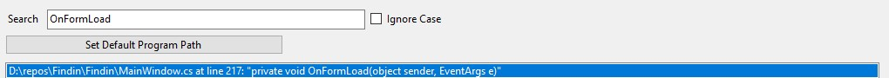
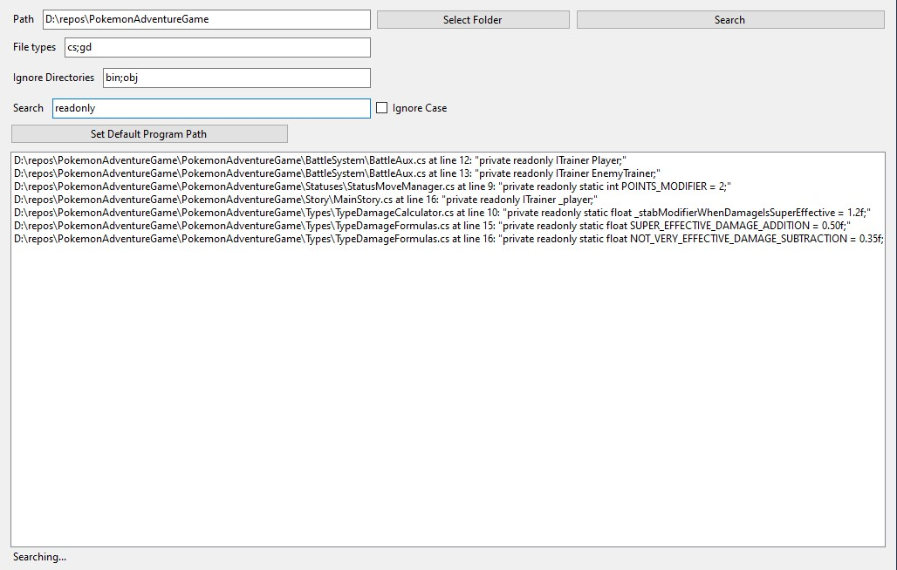

# Find In

A search tool to look for files by their content.

I created this program because I use Visual Studio at my job and I do not like it's search since its very slow and time consuming. It gets worse as the projects get bigger and legacy projects don't even seem to yield results at all, even when searching for a file (not for content inside them).

**This program aims for good performance and fast usage.**

You can get started by downloading a release and reading the usage section below. Feel free to colaborate and/or change it as you see fit. Maybe something different "here and there" fits your workflow better than its current state.

## Usage

When you open up the program for the first time, this is the screen you'll see:

And to make sense of each field and button:

- Path: The path where the files you want to search in are located. You can also click the "Select Folder" button and select the path from there;
- File types: The allowed file types to look for. You can put in a single pattern like `*.cs` or any amount you want, separated by ";" like `*.cs;*.py;*.c;*.go`;
- Ignore Directories: The name of directories you would like to ignore during the search. For example, a `node_modules` folder. You can ignore more than one directory like the file type filter: `bin;obj;wwwroot;node_modules`;
- Search: The search pattern you want to look for. The checkbox right after it allows you to make a case-insentive search;
- Set Default Program Path: The program you want to open up the files in. For example, if you found the match you were looking for, you can double-click the item listed in the white box and the file will be opened in it:

- The big white box: Is a `ListBox` that shows a line preview of the matched content inside a file.

- Search button: Searches for the search pattern you typed in, but you can also press the "Enter key" while in the search box.

With all fields filled, the form would look something like this:

**Important: when you close the program's window, it'll save the state in a file called `state.bin`. So do not worry about losing what you searched for after exiting the program.**

When we click search (or press Enter while in the Search box):

In the bottom left, we can see a `"Searching..."` text. This indicates that the program is still looking for files that could match the search pattern in it, **provided the search did not yield a number of matches greater then or equal to the match limit**.

During the search, one of two things can happen: 

The program will find too many matches and limit the top 50 (this match limit will be configurable in the future):

If not, the program will show how many matches it found:

-------------
## In Development

Even though this tool is still in development, it is ready to use. Here is a "To Do" list of the remaining tasks:

- ~~Search for files with specific extensions~~;
- ~~Search with regular expressions~~;
- ~~Remove regular expression field since the search is done with Regex from the get-go~~;
- ~~Re-think user experience~~;
- ~~Do not allow for search in binary files~~;
- ~~Allow the user to locate a path by searching for it inside the program with a folder helper~~;
- ~~Save the last search in a file that is always updated by each search made (this makes the "Search" button even better)~~;
- ~~_If a search button is really used, it should have a consistent tab index for a good navigation_~~;
- ~~Fix Regex when searching for characters such as "(" and "."~~;
- ~~Fix file paths with spaces~~;
- ~~Fix performance issue in the first directory loading, where the program must search for every possible directory (try `EnumerateFiles`)~~;
- ~~Allow the user to ignore certain directories~~;
- Allow for tabs with separate search states.

The list is updated per feature implementation, change request or bug fix.

**This tool will always be open-source and free to use.**
