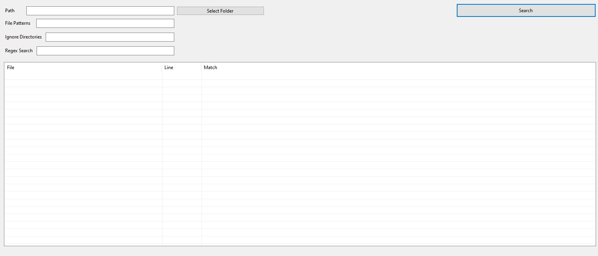
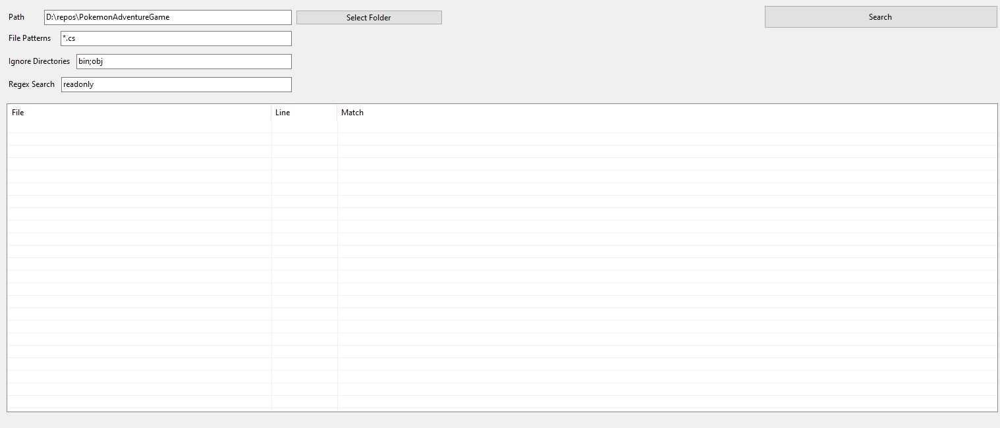

# Find In


Find In: A search tool to find files by content.

I created this program because I use Visual Studio at my job and I do not like it's search. It is generally very slow and time consuming, especially on larger repositories. It gets worse as the projects grow bigger and legacy projects don't even seem to yield some results at all, even when searching for a file (not only for content inside them); although some use cases may vary, like quickly searching for content in more than one repository.

-------------

## Download

You can get started by downloading the latest release and reading the "Usage" section. Since the program creates a file to save state (explained in more detail down below), you can extract the executable to a separate directory and use it from there. 

I also recommend you pin it to your taskbar. :)

-----------

## Usage

When you run the program for the first time, this is the screen you'll see:



To make sense of each field and button:

- *Path*: The path where the files you want to search in are located. You can also click the "Select Folder" button and select the path from there;

- *File Patterns*: The allowed file patterns to look for. You can put in a single extension like `*.cs` or any amount of patterns you want, separated by `;`. For example: `*.cs;*test.py;*.c;*score.go`;

- *Ignore Directories*: The directories you'd like to ignore during the search, like a `node_modules` directory. You can also ignore more than one directory: `bin;obj;wwwroot;node_modules`;

- *Regex Search*: The search pattern you want to look for using a regular expression;

- *The big table*: Its a `ListView` that shows a table with the matches. It displays each line with three columns containing the path to the file, the line number and part of the content matched in the line if it surpasses the character limit, otherwise only part of it is shown;

- *Search* button: Searches for the pattern you typed in, but you can also press `Enter` in any text field to do that.

With all fields filled, the form should look something like this:



**Important: when you close the program, it'll save the state in a file called `state.bin`. So do not worry about losing what you have searched for after exiting the program.**

After searching, the matches should be displayed:


In the bottom left corner, you can see how many occurrences and lines the program found. **The number of lines shown is limited to 500, but all desired files are searched so you can know how many occurrences were found**.

If the program takes a bit longer to find all matches, you'll see a `Searching...` label in that same corner before the results, occurrences and lines are displayed.

To copy content, you can right-click a line and you'll be greeted with the following context menu:


- *Copy File Path*: Copies the full file path;
- *Copy Formatted*: Copies the file name, line and content formatted as:

```
    File: Program.cs
    Line: 6
    Content: public static void Main(string[] args) {
```

--------------

## Default text editor or IDE to open results

If your favorite text editor or IDE supports command line arguments, you can configure Findin to open the results there:

In the same directory as the program (`Findin.exe`), you should add another file called `config_editor.txt`, which will hold information on how you want the program to be opened. It should have the following format:

```
TextEditorProgramName=
TextEditorPath=
CommandLineArguments=
TextEditorProgramNameWithExtension=
```

<br>

### To make sense of each line:

- `TextEditorProgramName`: Should contain the name of your program to be shown in the context menu, formatted as: `Open in {TextEditorProgramName}`. It'll be the first option shown in the context menu;

- `TextEditorPath`: The path where the executable is located in;

- `CommandLineArguments`: In this line, you should set the command line arguments that you want to use in your program, like an option for scrolling to a line, for example. Note that there are two values which will be replaced by other information: `[LN]` and `[FP]`. `[LN]` stands for line number and `[FP]` is the filepath (see example below);

- `TextEditorProgramNameWithExtension`: Here, you should pass the program's name with it's extension or the command used to open it in the command line.

<br>

After putting all this information together in the file, it should look something like this:

```
TextEditorProgramName=Emacs
TextEditorPath=C:/Program Files/Emacs/emacs-28.1/bin
CommandLineArguments=+[LN] [FP] -n
TextEditorProgramNameWithExtension=emacsclient
```

Now, when you open Findin, your context menu should have a new option:


Note that if you want to change something in the text editor configs while the program is running, you should restart it to see changes take effect. For errors, if something went wrong in your configs or Findin can't open the program, a message will be displayed containing the error.

------------

Feel free to make pull requests and/or change it as you see fit. Maybe something different "here and there" fits your workflow better than the program's current state. **This tool will always be open-source and free to use. The next milestone is to release a cross-platform version.**
