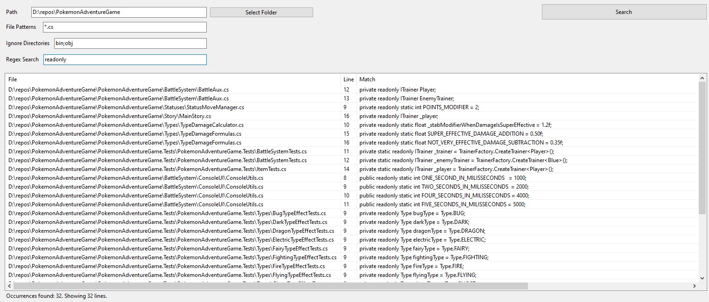

# Find In

Find In: A search tool to find files by content.

I created this program because I use Visual Studio at my job and I do not like it's search. It is generally very slow and time consuming, especially on larger repositories. It gets worse as the projects grow bigger and legacy projects don't even seem to yield some results at all, even when searching for a file (not only for content inside them); although some use cases may vary, like quickly searching for content in more than one repository.

## Download

You can get started by downloading the latest release and reading the "Usage" section. Since the program creates a file to save state (explained in more detail down below), you can extract the executable to a separate directory and use it from there. 

I also recommend you pin it to your taskbar. :)

## Usage

When you run the program for the first time, this is the screen you'll see:

To make sense of each field and button:

- *Path*: The path where the files you want to search in are located. You can also click the "Select Folder" button and select the path from there;

- *File Patterns*: The allowed file patterns to look for. You can put in a single extension like `*.cs` or any amount of patterns you want, separated by `;`. For example: `*.cs;*test.py;*.c;*score.go`;

- *Ignore Directories*: The directories you'd like to ignore during the search, like a `node_modules` directory. You can also ignore more than one directory: `bin;obj;wwwroot;node_modules`;

- *Regex Search*: The search pattern you want to look for using a regular expression;

- *The big table*: Its a `ListView` that shows a table with the matches. It displays each line with three columns containing the path to the file, the line number and part of the content matched in the line if it surpasses the character limit, otherwise only part of it is shown;

- *Search* button: Searches for the pattern you typed in, but you can also press `Enter` in any text field to do that.

With all fields filled, the form should look something like this:

**Important: when you close the program, it'll save the state in a file called `state.bin`. So do not worry about losing what you have searched for after exiting the program.**

After searching, the matches should be displayed:

In the bottom left corner, you can see how many occurrences and lines the program found. **The number of lines shown is limited to 500, but all desired files are searched so you can know how many occurrences were found**.

If the program takes a bit longer to find all matches, you'll see a `Searching...` label in that same corner before the results, occurrences and lines are displayed.

## How does it actually work?

If you want to know how it works in detail, you can do that by taking a look at the `MainWindow.cs` file.

-----

Feel free to make pull requests and/or change it as you see fit. Maybe something different "here and there" fits your workflow better than the program's current state. **This tool will always be open-source and free to use. The next milestone is to release a cross-platform version.**
